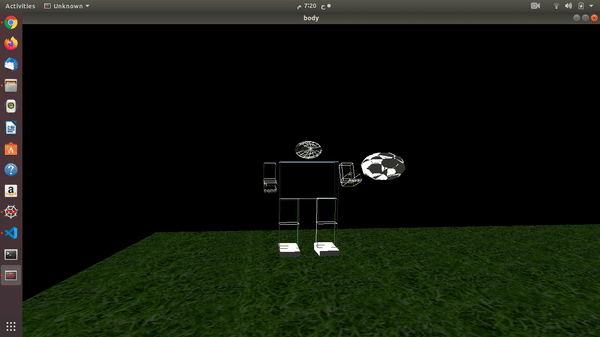

# Computer Graphics_final_project
<!--Headline-->
<!--Image-->
<!--UL-->
<!-- URLs-->
# Group ID: 20
# Team Members:&nbsp;&nbsp;&nbsp;&nbsp;&nbsp;&nbsp;&nbsp;&nbsp;&nbsp;&nbsp;&nbsp;&nbsp;&nbsp;&nbsp;&nbsp;&nbsp;&nbsp;&nbsp;&nbsp;&nbsp;&nbsp;&nbsp;&nbsp;&nbsp;&nbsp;&nbsp;&nbsp;Sec:&nbsp;&nbsp;&nbsp;&nbsp;&nbsp;ID:     
## Youssef Sameh Mohamed Yasen&nbsp;&nbsp;&nbsp;&nbsp;&nbsp;&nbsp;&nbsp;&nbsp;&nbsp;&nbsp;&nbsp;&nbsp;&nbsp;&nbsp;&nbsp;&nbsp;&nbsp;&nbsp;Sec:2&nbsp;&nbsp;&nbsp;ID:45&nbsp;&nbsp;&nbsp;[E-mail] yossefsameh23@gmail.com

## Omar Ibrahim Mohsen Sayed Ahmed&nbsp;&nbsp;&nbsp;&nbsp;&nbsp;&nbsp;&nbsp;&nbsp;&nbsp;Sec:2&nbsp;&nbsp;&nbsp;ID:10&nbsp;&nbsp;&nbsp;[E-mail] iomar9606@gmail.com 

## Mennatullah Raafat Mohamed Ahmed &nbsp;&nbsp;&nbsp;&nbsp;&nbsp;&nbsp;Sec:2&nbsp;&nbsp;&nbsp;ID:34&nbsp;&nbsp;&nbsp;[E-mail] menna12rere@gmail.com   

## Mustafa Mohamed Tufik Mahmoud&nbsp;&nbsp;&nbsp;&nbsp;&nbsp;&nbsp;&nbsp;&nbsp;&nbsp;&nbsp;&nbsp;&nbsp;Sec:2&nbsp;&nbsp;&nbsp;ID:32&nbsp;&nbsp;&nbsp;[E-mail] Mostafa.mohamed15397@gmail.com   

## Gehad Mohamed Ahmed Ali Mohamed&nbsp;&nbsp;&nbsp;&nbsp;&nbsp;&nbsp;Sec:1&nbsp;&nbsp;&nbsp;ID:27&nbsp;&nbsp;&nbsp;[E-mail] gehad.mohamed887@gmail.com

# Our Project results:

## The floor and the full body on the top of it with adding the light interaction:

## The floor after putting the texture mapping:

## The object which is added:

## The scene after adding object and texture mapping:
### The scene represents, someone who plays football in a playground.

## First animated motion:
### Someone who walks in an intermediate speed.

## Second animated motion:
### Someone who is doing workouts.
issues that you faced and how you fixed them. 
## Issues that we have faced and how we fixed them:
* First issue was with working on codeblocks on windows, it wasn't applicable to add texture mapping on it, the same for adding objects, it wasn't applicable at all, the solution was working on ubuntu instead of windows.  
* We faced a problem when we tried to add the light to our scene, it is solved by a lot of trials from more than one team member by putting more than suggestion the error can be from what !
* We faced a problem in using the right click button to control the texture mapping, we tried to ask others but we didn't succeed in applying the ideas which were suggested.
* In first trials to put the texture mapping it wasn't appeared, it is obtained the reason for that (bind) wasn't applied.
* We faced problem in linking our codes with each other, so we make a respiratory group on github to push our works on it and edit on each other.
## The biomedical idea behind our design:
* Our design simulates walking motion and exercise practicing, that can be helpful in simulating the motions that robotic design can do, it is needed to make a simulation for motions that you want your robot to do, so to check the limitations in movements if they are set as required or not before the step of manufacturing, robots in biomedical field are represented in exoskeletons, rehabilitation (which helps in the speed), life saving medical supplies, robotic surgery and alot of examples which will need a simulation that can specify the desired motions in robotic manufacturing. 